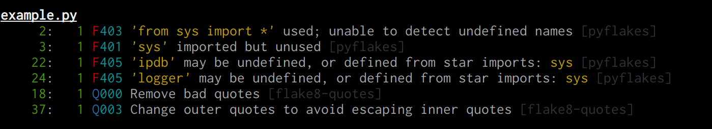
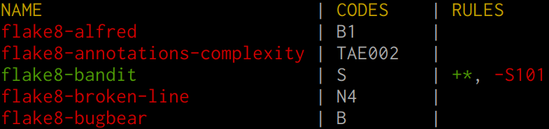
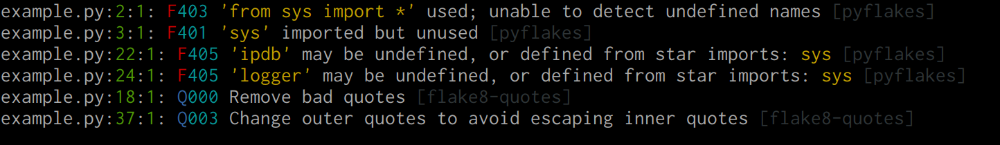
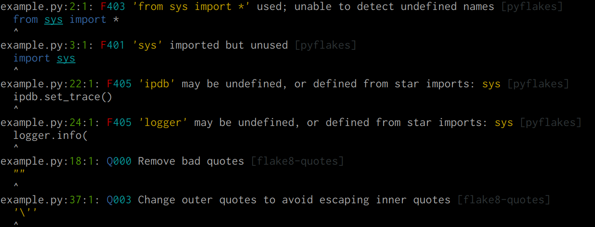
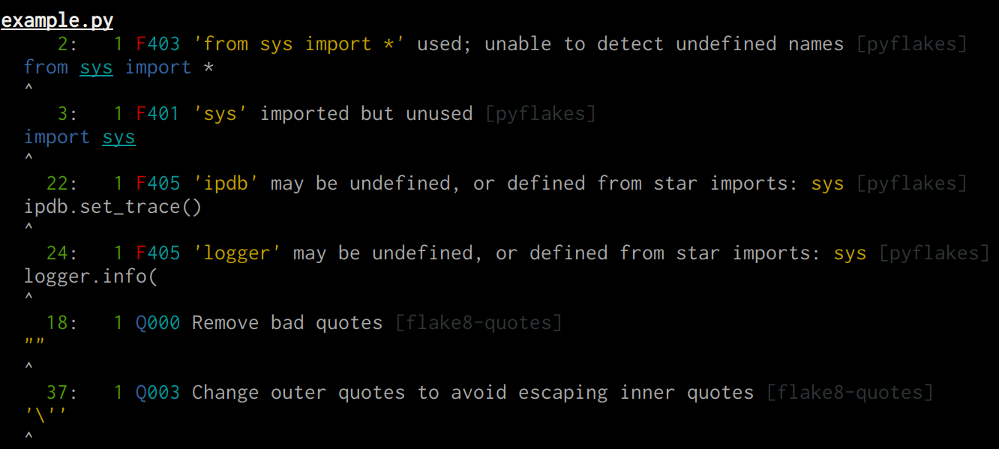
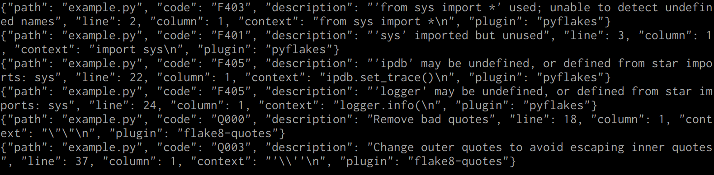

# FlakeHell

It's a [Flake8](https://gitlab.com/pycqa/flake8) wrapper to make it cool.

+ Sharable and remote configs.
+ Legacy-friendly: ability to get report only about new errors.
+ Use only specified plugins, not everything installed.
+ Manage codes per plugin.
+ Enable and disable plugins and codes by wildcard.
+ Make output beautiful.
+ `pyproject.toml` support.
+ Show codes for installed plugins.
+ Show all messages and codes for a plugin.
+ Check that all required plugins are installed.
+ Syntax highlighting in messages and code snippets.



## Installation

```bash
python3 -m pip install --user flakehell
```


## Usage

First of all, let's create `pyproject.toml` config:

```toml
[tool.flakehell]
# optionally inherit from remote config (or local if you want)
base = "https://gitlab.com/life4/flakehell/raw/master/pyproject.toml"
# specify any flake8 options. For example, exclude "example.py":
exclude = ["example.py"]
# make output nice
format = "grouped"
# 80 chars aren't enough in 21 century
max_line_length = 90
# show line of source code in output
show_source = true

# list of plugins and rules for them
[tool.flakehell.plugins]
# include everything in pyflakes except F401
pyflakes = ["+*", "-F401"]
# enable only codes from S100 to S199
flake8-bandit = ["-*", "+S1**"]
# enable everything that starts from `flake8-`
"flake8-*" = ["+*"]
# explicitly disable plugin
flake8-docstrings = ["-*"]
```

+ You can specify any flake8 settings in `[tool.flakehell]`.

Show plugins that aren't installed yet:

```bash
flakehell missed
```

Show installed plugins, used plugins, specified rules, codes prefixes:

```bash
flakehell plugins
```



Show codes and messages for a specific plugin:

```bash
flakehell codes pyflakes
```


Run flake8 against the code:

```bash
flakehell lint
```

This command accepts all the same arguments as Flake8.

## Formatters

Formatters make errors output nice. Available formatters:

+ `colored` -- for humans.
+ `grouped` -- also colored, but all messages are explicitly grouped by file.
+ `json` -- no colors, only one json-dict per line for every error.

Also, you can specify `show_source = true` in the config to show line of source code where error occurred with syntax highlighting.

Colored:



Colored with source code:



Grouped:


Grouped with source code:



JSON:




## Integrating into a huge codebase

First of all, let's create baseline.

```bash
flakehell baseline > baseline.txt
```

Then specify path to the baseline file:

```toml
[tool.flakehell]
baseline = "baseline.txt"
```

Now, `flakehell lint` command will ignore all your current errors. It will report only about new errors, all errors in a new code, or if old line of code was modified.
