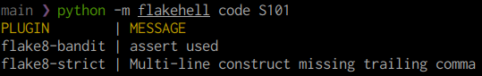

# **code**: find the given code

Show plugin name and message for the given code. Different plugins can have the same codes, so we're showing the result as a table. It looks for code only in installed plugins.

```bash
flakehell code F704
```


